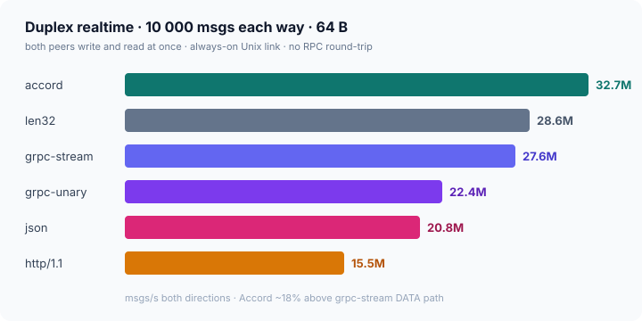
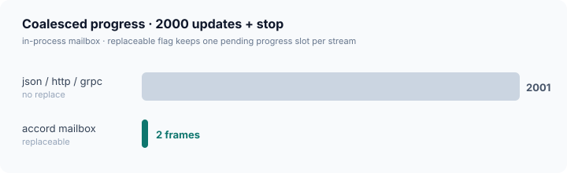
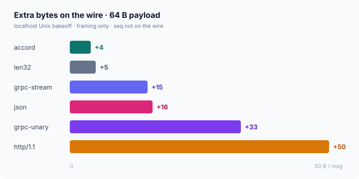
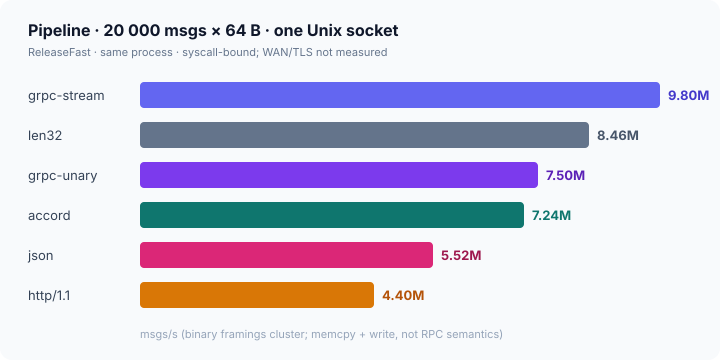
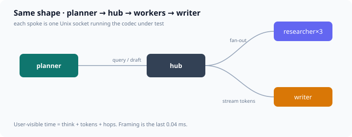
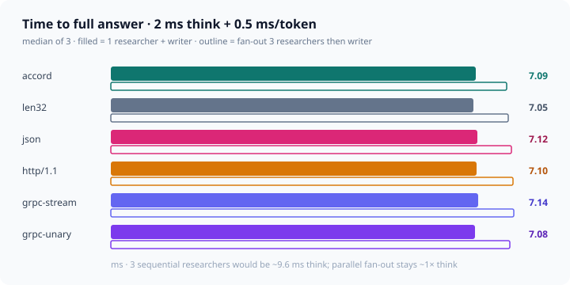
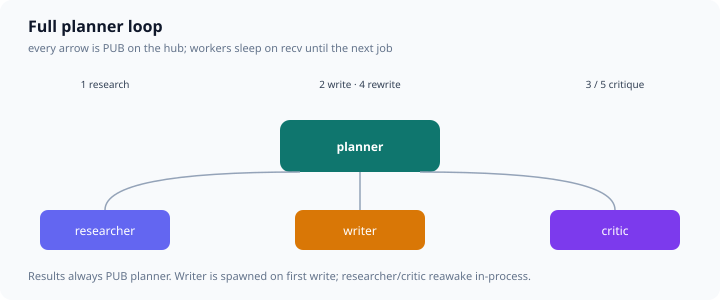
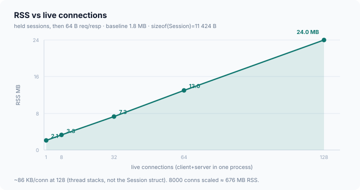

# Accord

A duplex realtime link for agents: one always-on socket, many streams, 4-byte frames. Same envelope on an in-process mailbox and on a Unix socket (TLS/QUIC can wrap later).

Wire preface: `ACD1` + version + reserved + `max_frame` (u16le). Frame: `len:u16le | stream:u8 | kind:u4 | flags:u4`. Sequence numbers are not on the wire. Control (ping/stop/goaway) lives on stream 0 and flushes immediately; data corks into a 16 KiB writer buffer.

Default trust is local Unix sockets with `chmod 0600`. Do not bind this framing on TCP as-is. Both peers on a native socket speak Accord (same as gRPC); HTTP/MCP clients go through a gateway.

Requires Zig 0.15+ (developed on 0.17.0-dev).

```
zig test src/accord.zig
zig build run    # mailbox + live Unix demo
zig build eval   # framing bakeoff (ReleaseFast)
zig build load   # concurrent conns + RSS
zig build real   # agent-shaped live scenarios (chat, stop, bidi, tools, multi-agent, pub/sub loop)
```

Numbers below are localhost Unix, same process, ReleaseFast — framing + syscalls, not WAN/TLS/HPACK. `grpc-stream` is HTTP/2 DATA + gRPC prefix only (no per-message HEADERS, no WINDOW_UPDATE). Pipeline trials are interleaved medians of 5.

## Duplex realtime

This is the shape Accord is for: both peers writing and reading at once, no RPC turn.



Stop-under-load (2000 progress then stop): Accord 13 µs p50 vs grpc-stream 23 µs. Replaceable progress still collapses 2001 frames to 2 on the mailbox.



## Extra bytes



| protocol | extra / msg | 64 B on the wire |
|---|---:|---:|
| accord | +4 | 68 |
| len32 | +5 | 69 |
| grpc-stream | +15 | 79 |
| json | +16 | 80 |
| grpc-unary | +33 | 97 |
| http/1.1 | +50 | 114 |

## Pipeline

Unidirectional flood, one ack. At 64 B Accord edges the gRPC DATA path; at 1 KiB everyone clusters on memcpy.



Ping-pong RTT is ~4.2 µs p50 for every binary codec (syscall floor).

## Multi-agent hub (same shape, every codec)

Planner, hub, researcher(s), writer — the `zig build real` multi_agent topology, but each spoke is framed with Accord / len32 / JSON / HTTP/1.1 / gRPC DATA / gRPC unary. The hub relays; it does not translate.



**Framing only** (no think, no token pacing) — this is the protocol tax on that shape:

| protocol | TTFB | research | draft | total |
|---|---:|---:|---:|---:|
| accord | 0.02 ms | 0.02 ms | 0.02 ms | 0.04 ms |
| len32 | 0.02 | 0.02 | 0.02 | 0.04 |
| json | 0.02 | 0.02 | 0.02 | 0.04 |
| http/1.1 | 0.02 | 0.02 | 0.02 | 0.04 |
| grpc-stream | 0.02 | 0.02 | 0.02 | 0.03 |
| grpc-unary | 0.02 | 0.02 | 0.02 | 0.04 |

**Simulated response** — researcher thinks 2 ms, then 0.5 ms per token (1 fact + 6-word draft). That is the time a user would wait:

| protocol | TTFB | research | draft | **answer** |
|---|---:|---:|---:|---:|
| accord | 2.55 ms | 3.20 ms | 3.89 ms | **7.09 ms** |
| len32 | 2.55 | 3.19 | 3.85 | 7.05 |
| json | 2.56 | 3.21 | 3.91 | 7.12 |
| http/1.1 | 2.56 | 3.18 | 3.91 | 7.10 |
| grpc-stream | 2.57 | 3.22 | 3.92 | 7.14 |
| grpc-unary | 2.56 | 3.21 | 3.87 | 7.08 |

Fan-out 1→3 researchers in parallel, then writer: ~7.7 ms to answer (think overlaps; 3 sequential researchers would be ~9.6 ms of think alone).



Framing is ~0.04 ms of a ~7 ms reply. The codec matters for floods, not for one user-visible answer.

Accord itself is **not** pub/sub — it is the duplex link. A hub on top is the broker: agents `SUB` a topic and sleep on `recv`; `PUB` is a `send` that wakes whoever is subscribed.

The full loop (`zig build real` `pubsub_loop`) is always back to the planner:



1. `PUB research` → sleeping researcher wakes  
2. `PUB write` → **no subscriber** → hub **spawns** the writer (Claude Code-style)  
3. `PUB critique` → critic says `revise`  
4. `PUB write` → same writer process reawakes  
5. `PUB critique` → `ok` → `BYE`

Graff integration (subagents, MCP gateway, `graff serve`) is sketched in [docs/GRAFF.md](docs/GRAFF.md). Do not patch the graff binary until Accord has a conformance vector.

On floods Accord already leads the duplex and 64 B pipeline bakeoff; 1 KiB is memcpy-bound for everyone. The hub no longer 200 µs-polls — each slot has a blocked `recv` pump into a queue.

## RSS at many connections

8 000 inflight is not 8 000 `Session`s — a handful of duplex links × many streams. Holding connections is what costs RSS (`Io.concurrent` reader stacks).



| shape | time | ΔRSS |
|---|---:|---:|
| pipeline 8000 msgs, 1 conn | 0.5 ms | ~0 |
| mailbox 8000 posts | 0.1 ms | 0.81 MB |
| 128 live sessions | — | 13.1 MB (28.4 MB RSS) |
| 8000 conns (scaled from 128) | — | ~816 MB |
